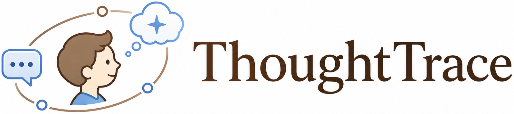
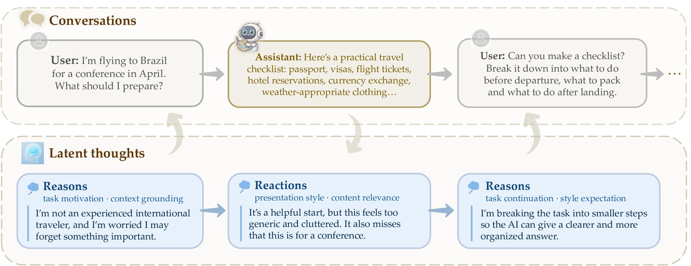

<p align="center">
  
</p>

<h2 align="center">Understanding User Thoughts in Real-World LLM Interactions</h2>

<p align="center">
  🌐 <a href="https://thoughttrace-project.github.io/">Project Page</a> &nbsp;·&nbsp;
  📄 <a href="https://arxiv.org/abs/2605.20087">Paper</a> &nbsp;·&nbsp;
  🤗 <a href="https://huggingface.co/datasets/SCAI-JHU/ThoughtTrace">Dataset</a>
</p>

---

Conversational AI has reached billions of users, yet existing datasets capture only what people *say*, not what they *think*.
***ThoughtTrace*** is the first large-scale dataset that pairs real-world multi-turn human–AI conversations with users' self-reported thoughts: their *reasons* for sending prompts and *reactions* to assistant responses.

Our analysis shows that *ThoughtTrace* captures long-horizon, topically diverse interactions, and that thoughts are semantically distinct from messages, difficult for frontier LLMs to infer from context, and tied to conversation stages. Thoughts also provide actionable signals for *user-behavior prediction* (+41.7% relative gain) and *model alignment* (+25.6% win rate).

<p align="center">
  
</p>

## What's Inside a Thought?

Every thought is anchored to a single message and falls into one of two kinds:

- **Reasons** are attached to *user* messages and capture the underlying motivation, prior context, expectations, or constraint that shaped the prompt. They are organized into 7 categories, including *Task Motivation & Goal*, *Context Grounding & Constraints*, and *Content Expectation*.
- **Reactions** are attached to *assistant* messages and capture the user's internal response — affirmation, frustration, partial satisfaction, or specific complaints. They are organized into 5 categories, with *Explicit Affirmation* most common and dissatisfaction split across content relevance, presentation style, and scope fit.

A single message may carry multiple thoughts. Thought dynamics shift predictably across the conversation: *Task Motivation* dominates early turns, *Task Continuation* takes over later, and *Explicit Affirmation* steadily rises as conversations converge on a satisfactory answer.

## Why Thoughts Matter

Four properties show why thoughts are a distinct, complementary modality beyond conversation transcripts:

1. **Thoughts are different from messages.**
2. **Thoughts are difficult for LLMs to infer.**
3. **Thoughts are diverse in content.**
4. **Thought dynamics depend on conversation stages.**

As a first step, we present two case studies demonstrating the downstream value of thoughts:

1. **Thoughts predict user behavior.**
2. **Thoughts improve model alignment.**

## Dataset Structure

Each record corresponds to a single conversation in which a participant interacted with one of 20 language models to complete an open-ended everyday task.
A participant may contribute multiple conversations across one or more tasks.

```text
conversation
├── id                          # e.g. "user1_task1_conversation1"
├── model_name                  # e.g. "GPT-5.4", "Claude Opus 4.6"
├── model_provider              # e.g. "OpenAI", "Anthropic"
├── created_at                  # ISO timestamp, conversation start
├── updated_at                  # ISO timestamp, last activity
├── task_summary                # post-hoc: what the user was trying to do
├── task_expectation            # post-hoc: what the user expected from the AI
├── survey_answers[]            # demographics
│   ├── age
│   ├── gender
│   ├── education
│   ├── occupation
│   ├── frequency               # AI-usage frequency
│   └── purposes                # primary use cases
└── messages[]
    ├── id
    ├── timestamp               # ISO timestamp
    ├── type                    # "user" | "assistant"
    ├── content                 # message text
    └── reasons[]               # only on user messages
        ├── content
        ├── timestamp
        ├── label               # one of 7 reason types
    └── reactions[]             # only on assistant messages
        ├── content
        ├── timestamp
        ├── label               # one of 5 reaction types
```

## Repository Layout

```
ThoughtTrace/
├── assets/                          # project icon and figures used in this README
├── data/
│   ├── ThoughtTrace.jsonl           # full dataset (2,155 conversations)
│   └── ThoughtTrace_examples.jsonl  # small sample for quick inspection
├── filter_conversations.ipynb       # query the dataset by message/thought count, model, or demographics
├── check_dataset_stats.ipynb        # compute global and per-model counts (users, conversations, messages, thoughts)
└── requirements.txt
```

### Code files

- **`filter_conversations.ipynb`** — utilities to slice the dataset along multiple axes (number of messages or thoughts, model name/provider, age range, gender, education, AI-usage frequency).
- **`check_dataset_stats.ipynb`** — reports user / conversation / message / thought counts, either aggregated or broken down per model.

## Getting Started

```bash
git clone https://github.com/thoughttrace-project/thoughttrace.git
cd thoughttrace
pip install -r requirements.txt
```

Load the dataset:

```python
# Option 1: from HuggingFace
from datasets import load_dataset
ds = load_dataset("SCAI-JHU/ThoughtTrace", split="train")
data = {row["id"]: row for row in ds}

# Option 2: from local JSONL
import json
data = {}
with open("data/ThoughtTrace.jsonl") as f:
    for line in f:
        row = json.loads(line)
        data[row["id"]] = row
```

## Suggested Uses

- **User modeling and simulation.** Build user simulators that predict the next *thought* and the next *message*.
- **Alignment and personalization.** Use thoughts as fine-grained preference signals.
- **Cognitive and behavioral analysis.** Study how thoughts evolve across stages and vary with assistant behavior and demographics.
- **Benchmarking.** Evaluate how well models recover user goals, expectations, and reactions from conversation context.

## Citation

If you use ThoughtTrace, please cite:

```bibtex
@article{jin2026thoughttrace,
  title={ThoughtTrace: Understanding User Thoughts in Real-World LLM Interactions},
  author={Jin, Chuanyang and Li, Binze and Xie, Haopeng and Fang, Cathy Mengying and Li, Tianjian and Longpre, Shayne and Gu, Hongxiang and Chen, Maximillian and Shu, Tianmin},
  journal={arXiv preprint arXiv:2605.20087},
  year={2026}
}
```
